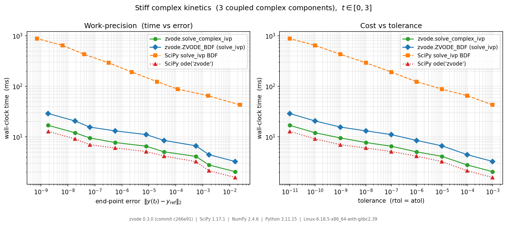

:orphan:

.. _benchmarks:

Benchmarks — work-precision diagram
===================================

How much does the Python interface cost?  For a small stiff system the
integrator spends most of its time on per-step fixed costs and Python
call-backs rather than on linear algebra — the *latency-bound* regime.  This
page quantifies that overhead by comparing four ways of solving the **same**
stiff, complex-valued ODE and plotting cost (wall-clock time) against accuracy
(end-point error): a *work-precision diagram*.

Solver paths
------------

.. list-table::
   :header-rows: 1
   :widths: 45 55

   * - Path
     - What it exercises
   * - ``zvode.solve_complex_ivp``
     - zvode's low-overhead procedural API
   * - ``zvode.ZVODE_BDF`` via :func:`~scipy.integrate.solve_ivp`
     - zvode's scipy-compatible ``OdeSolver`` subclass
   * - :func:`~scipy.integrate.solve_ivp` ``method="BDF"``
     - SciPy's pure-Python BDF integrator
   * - :class:`scipy.integrate.ode` ``("zvode", method="bdf")``
     - the classic Fortran ZVODE wrapper shipped with SciPy

Paths 1, 2 and 4 all drive the *same* Fortran ZVODE core, so they take
(nearly) identical step sequences — the gap between them is pure interface
overhead.  Path 3 is a different algorithm implemented in Python and serves as
the pure-Python ``OdeSolver`` reference.

.. note::

   SciPy's :class:`scipy.integrate.ode` selects functional iteration
   (``MITER=0``, no Newton/Jacobian) for ``"zvode"`` unless you pass
   ``with_jacobian=True``.  On a stiff problem the functional-iteration path
   caps the integration order and takes far more (tiny) steps, so the
   benchmark passes ``with_jacobian=True`` to obtain a fair stiff baseline.

Test problem
------------

A small complex *autocatalytic kinetics* system with a conserved total mass:

.. math::

   \begin{aligned}
   y_1' &= -a\,y_1 + b\,y_2 y_3 \\
   y_2' &=  a\,y_1 - b\,y_2 y_3 - c\,y_2 \\
   y_3' &=  c\,y_2
   \end{aligned}

with :math:`a = 1000 + 200i`, :math:`b = 1000`, :math:`c = 1 + 50i`, initial
state :math:`y(0) = (1,\, 0.2i,\, 0)` and :math:`t \in [0, 3]`.  It has the
properties we want in a benchmark:

- **Three non-linearly coupled, genuinely complex components** — the
  ``y2*y3`` term provides the non-linearity; complex coefficients and initial
  data keep the state complex throughout.
- **Holomorphic** — the right-hand side is a polynomial, so it is
  complex-analytic (no ``conj``/``abs``), the regime ZVODE is designed for.
- **Stiff** — the large rate :math:`a` separates the time scales.
- **Bounded and self-checking** — :math:`y_1 + y_2 + y_3` is conserved, so the
  drift ``|sum(y(t_f)) - sum(y(0))|`` doubles as a correctness check for every
  solver (it stays at the round-off level in the run below).

Results
-------

Lower is better: for a target accuracy (left panel) or tolerance (right panel),
the lower curve reaches it in less wall-clock time.

The numbers below are from one reference run; the exact library versions and
the zvode commit are stamped onto the figure and printed by the script.  Median
wall-clock time across the tolerance sweep, relative to the classic
``scipy.integrate.ode("zvode")`` baseline (lower means less overhead):

.. list-table::
   :header-rows: 1
   :widths: 60 40

   * - Path
     - Median time vs ``ode("zvode")``
   * - ``scipy.integrate.ode("zvode")``
     - 1.00× (baseline)
   * - ``zvode.solve_complex_ivp``
     - ~1.2×
   * - ``zvode.ZVODE_BDF`` (``solve_ivp``)
     - ~2×
   * - ``scipy.integrate.solve_ivp("BDF")``
     - ~35×

Takeaways:

- ``zvode.solve_complex_ivp`` runs within ~20 % of the bare classic Fortran
  interface and produces an *identical* error curve to ``ode("zvode")``
  (same core, same steps) — a good cross-check that the thin wrapper adds cost
  but not numerical change.  That ~20 % is almost entirely per-call-back cost:
  for a plain-Python right-hand side, ``solve_complex_ivp`` routes each
  evaluation through one extra Python frame (to adapt ``f(t, y) -> array`` to
  ZVODE's in-place convention) where ``ode`` calls ``f`` directly from C and
  copies the result back with a ``memcpy``.  Collecting the full output
  trajectory, by contrast, costs under 2 % — ``solve_complex_ivp`` stores it in
  C, not in Python lists.  With a compiled (numba/ctypes) right-hand side the
  Python frame disappears and this path becomes *several times faster* than
  ``ode``, since the step loop *and* the right-hand side then run without the
  interpreter.
- The scipy-compatible ``ZVODE_BDF`` ``OdeSolver`` pays for a Python step loop
  (one Python round-trip per accepted step) yet still beats SciPy's
  pure-Python ``BDF`` by roughly an order of magnitude on this small system.
- SciPy's ``BDF`` is the slowest here precisely because the system is small:
  with only three components the Python per-step machinery dominates the
  actual linear algebra.

These ratios are interface overhead and are most pronounced for small systems;
as the system size grows the linear-algebra cost rises and the relative
overhead of any Python wrapper shrinks.

.. note::

   **Output mode.**  ``solve_complex_ivp`` and both ``solve_ivp`` paths collect
   the full step trajectory — ``solve_ivp``'s standard mode, and its cheapest
   (forcing endpoint-only with ``t_eval=(tf,)`` is *slower*, as ``solve_ivp``
   then runs an ``np.searchsorted`` per step).  ``ode("zvode")`` integrates
   straight to ``tf`` in a single call, its natural low-overhead mode.  Because
   collecting the trajectory is nearly free here, the three trajectory paths
   stay directly comparable to the single-shot baseline.

Reproducing
-----------

The benchmark is a single self-contained script.  Run it from the repository
root (needs ``scipy`` and ``matplotlib``)::

    python docs/bench_work_precision.py

It prints the per-tolerance timings and a versions/commit line, and writes
``docs/work_precision.png``.  The exact zvode commit and the SciPy / NumPy /
Python versions that produced any given figure are stamped along its bottom
edge, so the diagram is self-describing.  Re-run it on your own machine to get
numbers for your platform; absolute timings are machine-dependent, but the
ordering of the four paths is stable.

.. literalinclude:: bench_work_precision.py
   :language: python
   :caption: docs/bench_work_precision.py
