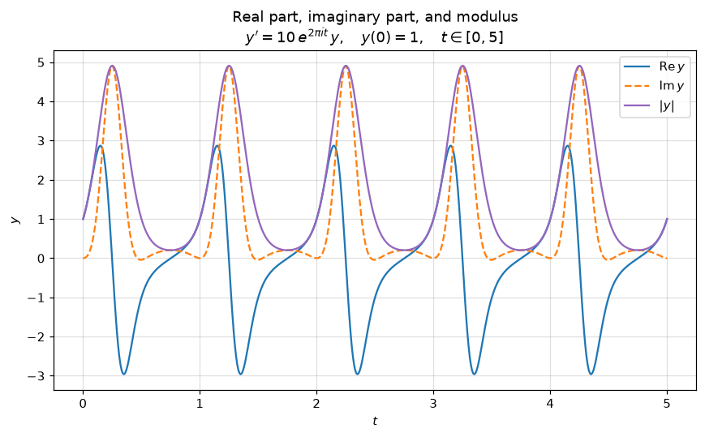
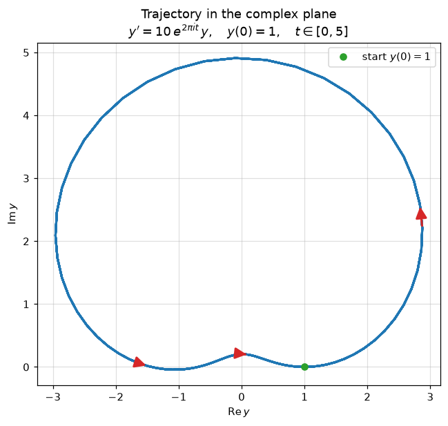

.. _tutorial-complex-ode:

Tutorial: solving and visualizing a complex ODE
===============================================

This tutorial walks through solving a single complex-valued ODE with
:func:`~zvode.solve_complex_ivp` and visualizing the result, reproducing an
example from the Wolfram Language documentation.

.. admonition:: Attribution

   The example problem and the idea of visualizing its solution come from
   `Solutions of Complex ODEs
   <https://www.wolfram.com/language/12/complex-visualization/solutions-of-complex-odes.html>`_
   in the Wolfram Language 12 documentation, where it is solved with
   ``NDSolveValue``.

The problem
-----------

We want to integrate the scalar, time-dependent complex ODE

.. math::

   y'(t) = 10\, e^{2\pi i t}\, y(t), \qquad y(0) = 1, \qquad t \in [0, 5].

The right-hand side is a (time-dependent) complex coefficient multiplying
``y``, so it is holomorphic in ``y``.  That is exactly the setting ZVODE is
built for: it advances the complex state directly, with no need to split the
problem into real and imaginary parts.

A reference solution
~~~~~~~~~~~~~~~~~~~~~~

This problem is separable and has a closed-form solution, which is handy for
checking accuracy.  From ``y'/y = 10\, e^{2\pi i t}`` we integrate to obtain

.. math::

   y(t) = \exp\!\left( \frac{10}{2\pi i}\,\bigl(e^{2\pi i t} - 1\bigr) \right).

Since :math:`e^{2\pi i t} = 1` whenever ``t`` is an integer, the exponent
vanishes there and the solution returns to ``y = 1`` at every integer time; in
particular ``y(5) = 1``.

Step 1 — define the right-hand side
-----------------------------------

The right-hand side takes the time ``t`` and the state vector ``y`` (here of
length 1) and returns ``y'``.  We write it to return a one-element list:

.. code-block:: python

   import numpy as np

   def rhs(t, y):
       # y'(t) = 10 e^{2πi t} y(t)
       return [10.0 * np.exp(2j * np.pi * t) * y[0]]

Because the coefficient does not depend on ``y``, the Jacobian
:math:`\partial f/\partial y = 10\, e^{2\pi i t}` is trivial, and for this
non-stiff problem we do not need to supply it.

Step 2 — integrate
------------------

:func:`~zvode.solve_complex_ivp` is the recommended entry point.  The problem
is non-stiff (a smooth, oscillatory coefficient), so we select the Adams
method.  Passing ``tspan`` as a full array of times requests the solution on
that grid, which makes the parametric plot below smooth:

.. code-block:: python

   from zvode import solve_complex_ivp

   t_eval = np.linspace(0.0, 5.0, 501)

   sol = solve_complex_ivp(
       fun=rhs,
       tspan=t_eval,
       y0=[1.0 + 0.0j],
       method="Adams",
       rtol=1e-10,
       atol=1e-12,
   )

   y = sol.y[0]   # complex array, shape (501,)

We can confirm the result against the closed form:

.. code-block:: python

   def exact(t):
       t = np.asarray(t, dtype=float)
       return np.exp((10.0 / (2j * np.pi)) * (np.exp(2j * np.pi * t) - 1.0))

   err = np.max(np.abs(y - exact(t_eval)))
   print(f"Max absolute error: {err:.2e}")   # ~9e-09

Step 3 — visualize
------------------

The Wolfram example draws the solution two ways.  Each is a few lines of
Matplotlib.

**The real part, imaginary part, and modulus versus the real variable** ``t``.
Plotting all three together shows the oscillation and its envelope at a glance;
the modulus peaks near ``|y| ≈ 5`` once per period and returns to 1 at every
integer ``t``:

.. code-block:: python

   import matplotlib.pyplot as plt

   plt.plot(t_eval, y.real, label=r"$\mathrm{Re}\,y$")
   plt.plot(t_eval, y.imag, "--", label=r"$\mathrm{Im}\,y$")
   plt.plot(t_eval, np.abs(y), label=r"$|y|$")
   plt.xlabel("$t$")
   plt.legend()

**The trajectory drawn parametrically in the complex plane.**  Plotting
``y.imag`` against ``y.real`` traces the path the solution follows.  Because the
solution is periodic with period 1, the curve is retraced five times over
``t ∈ [0, 5]``, so a single loop is all that is visible.  A couple of arrows
(drawn with :meth:`~matplotlib.axes.Axes.annotate` between successive sample
points) mark the direction of travel:

.. code-block:: python

   ax = plt.gca()
   ax.plot(y.real, y.imag, linewidth=2)
   ax.set_aspect("equal")

   # Arrows indicating the direction of travel along the curve.
   period = len(t_eval) // 5  # samples per unit-time period
   for frac in (0.15, 0.45, 0.78):
       i = int(frac * period)
       ax.annotate(
           "",
           xy=(y.real[i + 1], y.imag[i + 1]),
           xytext=(y.real[i], y.imag[i]),
           arrowprops=dict(arrowstyle="-|>", color="tab:red",
                           lw=2, mutation_scale=22),
       )

   ax.set_xlabel(r"$\mathrm{Re}\,y$")
   ax.set_ylabel(r"$\mathrm{Im}\,y$")

The complete, runnable script is ``demo_complex_ode.py``.

Next steps
----------

- Output modes, method selection, and supplying a Jacobian are covered in
  :doc:`how-to-procedural-api`.
- For larger or stiff systems, see :doc:`banded_jacobian` and
  :doc:`how-to-compiled-callbacks`.
